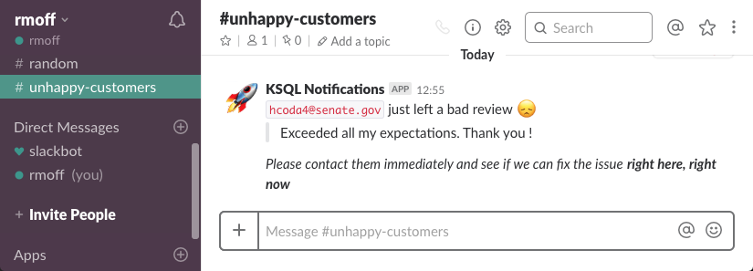
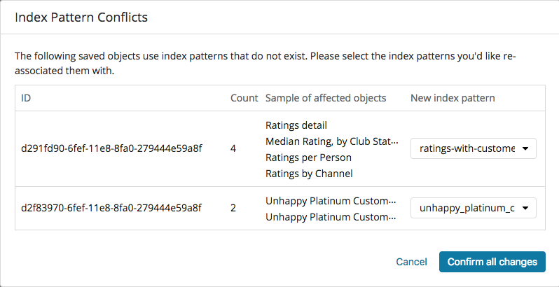

== Startup 

Run the stack: 

[source,bash]
----
docker-compose up -d
----

Deploy connectors etc: 

[source,bash]
----
./scripts/setup.sh
----

Check that the connectors are running: 

[source,bash]
----
curl -s "http://localhost:8083/connectors"| jq '.[]'| xargs -I{connector_name} curl -s "http://localhost:8083/connectors/"{connector_name}"/status"| jq -c -M '[.name,.connector.state,.tasks[].state]|join(":|:")'| column -s : -t| sed 's/\"//g'| sort
----

Should show: 

[source,bash]
----
mysql-source-demo-customers      |  RUNNING  |  RUNNING
mysql-source-demo-customers-raw  |  RUNNING  |  RUNNING
----

[source,bash]
----
curl -s "http://localhost:18083/connectors"| jq '.[]'| xargs -I{connector_name} curl -s "http://localhost:18083/connectors/"{connector_name}"/status"| jq -c -M '[.name,.connector.state,.tasks[].state]|join(":|:")'| column -s : -t| sed 's/\"//g'| sort
----

Should show: 

[source,bash]
----
es_sink_ratings-with-customer-data  |  RUNNING  |  RUNNING
es_sink_unhappy_platinum_customers  |  RUNNING  |  RUNNING
----

Note that the AWS S3 sink requires further setup, so will initially be in the `FAILED` state. 

== KSQL

To run the KSQL CLI: 

[source,bash]
----
docker run --network infoq-kafka-ksql_default --interactive --tty \
     confluentinc/cp-ksql-cli:5.0.0-beta180702222458 \
     http://ksql-server:8088
----

== Kafka Console Consumer

To run `kafka-console-consumer` within Docker setup, use: 

[source,bash]
----
docker-compose exec kafka \
    kafka-console-consumer \
    --bootstrap-server kafka:29092 \
    --topic UNHAPPY_PLATINUM_CUSTOMERS 
----

== Running the Python Slack/Kafka app

Virtualenv is useful for isolating your python libs etc

[source,bash]
----
virtualenv slack-kafka
# Source a different file depending on your shell
source ./slack-kafka/bin/activate.fish
----

Install the libs needed

[source,bash]
----
pip install slackclient confluent_kafka
----

Get your API token from https://api.slack.com/custom-integrations/legacy-tokens

Set your API token as an env var: 

[source,bash]
----
export SLACK_API_TOKEN=your-token-goes-here
----

Run the app: 

[source,bash]
----
python python_kafka_notify.py
----

You'll see echo'd to `stdout` each message that's processed and sent to Slack: 

[source,bash]
----
End of partition reached UNHAPPY_PLATINUM_CUSTOMERS/0
Received message: {"CLUB_STATUS":"platinum","EMAIL":"hcoda4@senate.gov","STARS":1,"MESSAGE":"Exceeded all my expectations. Thank you !"}

Sending message "`hcoda4@senate.gov` just left a bad review :disappointed:
> Exceeded all my expectations. Thank you !

_Please contact them immediately and see if we can fix the issue *right here, right now*_" to channel unhappy-customers
----

== Setup Kibana

In a browser, go to Kibana at http://localhost:5601/app/kibana#/management/kibana/indices/ and set an index (any index) as default (click the Star in the top-right)

Import dashboard `kibana_objects.json` using the **Import** button at http://localhost:5601/app/kibana#/management/kibana/objects

Load the Kibana dashboard http://localhost:5601/app/kibana#/dashboard/02028f30-424c-11e8-af19-1188a9332246

== Streaming data to S3 from Kafka

Create a file called `aws_creds.txt` in the same folder as the `docker-compose.yml`. This will be mounted and passed to Kafka Connect on startup. It should look like this: 

[source,bash]
----
[default]
aws_access_key_id=xxxxxxxxxxxxxxx
aws_secret_access_key=yyyyyyyyyyyyyy
----

Create the target bucket to write to and update `scripts/create-s3-sink.sh` accordingly with the region and bucket name. 

Deploy the connector:

[source,bash]
----
docker-compose exec kafka-connect-cp bash -c '/scripts/create-s3-sink.sh'
----

You should see the sink successfully running: 

[source,bash]
----
curl -s "http://localhost:18083/connectors"| jq '.[]'| xargs -I{connector_name} curl -s "http://localhost:18083/connectors/"{connector_name}"/status"| jq -c -M '[.name,.connector.state,.tasks[].state]|join(":|:")'| column -s : -t| sed 's/\"//g'| sort
es_sink_ratings-with-customer-data  |  RUNNING  |  RUNNING
es_sink_unhappy_platinum_customers  |  RUNNING  |  RUNNING
s3-sink-ratings                     |  RUNNING  |  RUNNING
----

In S3 you should see data: 

[source,bash]
----
$ aws s3 ls rmoff-demo-ratings/topics/ratings-with-customer-data/partition=0/
2018-07-20 13:26:29        569 ratings-with-customer-data+0+0000000000.json
2018-07-20 13:26:31        615 ratings-with-customer-data+0+0000000003.json
2018-07-20 13:26:32        587 ratings-with-customer-data+0+0000000006.json
2018-07-20 13:26:33        592 ratings-with-customer-data+0+0000000009.json
----

== Streaming data to Google Cloud Storage (GCS) from Kafka

Install the GCS connector: 

[source,bash]
----
docker-compose exec kafka-connect-cp bash -c 'confluent-hub install --no-prompt confluentinc/kafka-connect-gcs:5.0.0'
docker-compose restart kafka-connect-cp
----

Download your service account JSON credentials https://console.cloud.google.com/apis/credentials[from GCP] to a file called `gcp_creds.json`.This will be mounted and passed to Kafka Connect on startup. 

Create the target bucket to write to and update `scripts/create-gcs-sink.sh` accordingly with the region and bucket name. 

Deploy the connector:

[source,bash]
----
docker-compose exec kafka-connect-cp bash -c '/scripts/create-gcs-sink.sh'
----

You should see the sink successfully running: 

[source,bash]
----
curl -s "http://localhost:18083/connectors"| jq '.[]'| xargs -I{connector_name} curl -s "http://localhost:18083/connectors/"{connector_name}"/status"| jq -c -M '[.name,.connector.state,.tasks[].state]|join(":|:")'| column -s : -t| sed 's/\"//g'| sort
…
gcs-sink-ratings                     |  RUNNING  |  RUNNING
----

In GCS you should see data: 

[source,bash]
----
$ aws s3 ls rmoff-demo-ratings/topics/ratings-with-customer-data/partition=0/
2018-07-20 13:26:29        569 ratings-with-customer-data+0+0000000000.json
2018-07-20 13:26:31        615 ratings-with-customer-data+0+0000000003.json
2018-07-20 13:26:32        587 ratings-with-customer-data+0+0000000006.json
2018-07-20 13:26:33        592 ratings-with-customer-data+0+0000000009.json
----

