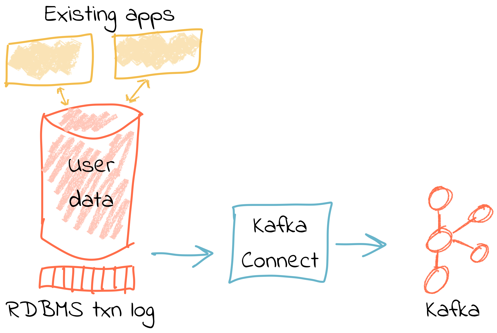
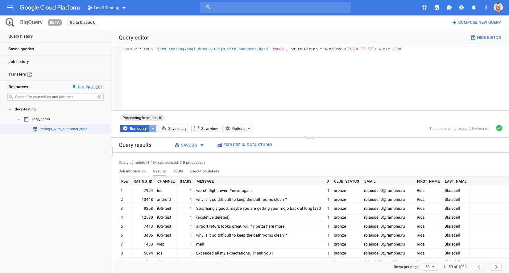

= Democratizing Stream Processing with Apache Kafka and KSQL, Part 2
Robin Moffatt <robin@confluent.io>
v0.30 24 Jul 2018

The way in which we handle data, and build applications to do so, is changing. Technology and development practices have evolved to a point where building systems in isolated silos is somewhat impractical, if not anachronistic. As the cliché of a cliché goes, data is the new oil, the life-blood of an organization—however you want to analogize it, the successful handling and exploitation of data in a company is critical to its success.

In this article we're going to see a practical example of a powerful design pattern based around event-driven architectures and a streaming platform. We'll discuss why companies are moving to adopt this, instead of legacy approaches to integrating systems—as well as driving real time requirements. 

Part of this shift away that is happening is the blurring of lines between "analytics" systems and "transactional" systems. In the old days, we built our transactional systems on which our business ran, and then a separate team would be responsible for extracting that data and building analytics (or BI, or MIS, or DSS, depending on your age) on that. It was done in an isolated manner, and was typically a one-way feed. Analytics teams took the data, on which processing was done to cleanse and enrich it, and then reports were built.

Now, we have the beginnings of an acceptance that data is not only _generated_ by systems, but combined with other data and insights can actually be used to _power_ those systems and others—and we have the technology that enables us to do so, in real time, and at scale. It's about enabling the integration of data across departments, teams, and even companies, making it available to any application that wants to do so, and building this in such a way that is flexible, scalable, and maintainable in the long term.

As an example of this, retail banks are faced with the challenge of providing compelling customer experience to a new generation of users, whose expectations are shaped by AI-powered mobile applications from Google and Apple. In order to meet this challenge, they'll need to combine everything they know about their customers with state of the art predictive models, and provide the results to mobile apps, web apps and physical branches. ING and RBC used event-driven architectures to power modern systems that do exactly that. Let's dive into how they transformed the user-experience and the development process at the same time.

== ETL, but not as you know it

Consider a simple example from the world of e-commerce: On a website, user reviews are tracked through a series of events. Information about these users such as their name, contact details, and loyalty club status is held on a database elsewhere. There are at least three uses for this review data:

- Customer Operations—If a user with high loyalty club status leaves a poor review, we want to do something about it straight away, to reduce the risk of them churning. We want an application that will notify us as soon as a review meeting this condition is met. By doing so immediately we offer customer service that is far superior than had we waited for a batch process to run and flag the user for contact at a later date.
- Operational dashboard showing live feed of reviews, rolling aggregates for counts, median score, and so on—broken down by user region, etc.
- Ad-hoc analytics on review data combined with other data (whether in a data lake, data warehouse, etc). This could extend to broader data science practices and machine learning use.

All of these need access to the review information along with details of the user.

One option is to store the reviews in a database, against which we then join a user table. Perhaps we drive all the requirements against the data held in this database. There are several challenges to this approach. Since we are coupling together three separate applications to the same schema and access patterns, it becomes more difficult to make changes to one without impacting the others. In addition, one application may start to impact the performance of another—consider a large-scale analytics workload and how this could affect the operational behavior of the customer ops alerting application.

In general, we would not expect to build the three applications against the same data store. Thus we extract the review and user data to target systems best suited for serving the dependent application. Perhaps a NoSQL store to drive the customer operations application, the Elastic stack for the ops dashboard, and something like HDFS/S3, or BigQuery/Snowflake DB for the analytics platform. 

image::images/complex01.png[]

Now we have the problem of:

- How to populate each target from the review data in a consistent and efficient way
- How to enrich the review data with user information - do we try and do it once before loading each target, or do we repeat the process as part of the loading of each target? Can we do this with up-to-date versions of the customer data whilst also maintaining a low-latency feed?

We also have longer-term architectural considerations. If we add new sources for the review data (e.g. mobile app, public API), how is that fed to the target systems? What if one of the target systems is offline, or running slowly—how do we buffer the data or apply back-pressure? If we want to add new targets for the data in the future, how easy will it be to do this?

== You say tomato, I say tomato

In the past we used ETL (Extract, Transform, Load) techniques purely within the data-warehousing and analytics space. But, if one considers _why_ and _what_ ETL is doing, it is actually a lot more applicable as a broader concept.

* Extract - data is available from a source system
* Transform - we want to filter, cleanse, or otherwise enrich this source data
* Load - make the data available to another application

There are two key concepts here:

* Data is created by an application, and we want it to be available to other applications.
* We often want to process the data in some way before it can be used. This could be to cleanse it, to apply business logic to it, and so on

Thinking about many applications that are being built nowadays, particularly in the microservices and event-driven space, what they do is take data from one or more systems, manipulate the data, and then pass it on to another application or system. For example—a fraud detection service will take data from merchant transactions, apply a fraud detection model, and write the results to a store such as Elastic for review by an expert. Can you spot the similarity to the above outline? Is this a microservice or ETL process? Or is actually what we used to call ETL a pattern that is a lot more broadly applicable nowadays?

== The Streaming Platform in Action

Let's see what the above e-commerce example looks like in practice when implemented using a more modern design pattern, based on a streaming platform. We're going to use the open-source Apache Kafka and KSQL projects to do this. KSQL is the streaming SQL engine for Apache Kafka, implemented on top of the Kafka Streams API which is part of Apache Kafka itself.

In our example, the _events_ are the reviews that the users submit on the site, and these are streamed directly into Kafka. From here, they can be joined to the user information _in real time_ and the resulting enriched data written back to Kafka. With this transformation done, the data can be used to drive the above applications and targets. The transformation logic is only required once. The data is extracted from the source system once. The transformed data can be used multiple times, by independent applications. New sources and targets can be added, without any change to the existing components. All of this is very low-latency.

At a high level, the design looks like this:

- Web app emits review directly to Kafka
- Kafka Connect streams snapshot of user data from database into Kafka, and keeps it directly in sync with CDC
- Stream processing adds user data to the review event, writes it back to a new Kafka topic
- Stream processing filters the enriched Kafka topic for poor reviews from VIP users, writes to a new Kafka topic
- Event-driven app listens to Kafka topic, pushes notifications as soon as VIP user leaves a poor review
- Kafka Connect streams the data to Elasticsearch for operational dashboard
- Kafka Connect streams the data to S3 for long-term ad-hoc analytics and use alongside other datasets

image::images/design.png[]

The benefits of this include:

- Data enrichment is done once, and available for any consuming application
- Processing is low latency
- Notifications to customer ops team happen as soon as the VIP customer leaves a poor review - much better customer experience, more chance of retaining their business
- Easy to scale by adding new nodes as required for greater throughput

== Transform Once, Use Many

Often the data used by one system will also be required by another, and the same goes for data that has been through enrichment or transformation. The work that we do to cleanse the inbound stream of customer details, standardize the country name, state/county identifiers, phone number formatting—all of this is going to be useful to both the analytics platform downstream, but also any other application that deals with customer data.

A great pattern to adopt is to stream data as it is transformed _back into Kafka_. This makes that data available, in real time, to all applications directly. The alternative is the legacy pattern of writing transformed data down to a target (often a data lake), and having other applications pull the data from there—with the associated latency and complication to our systems architecture. 

By streaming the transformed data back into Kafka, we get some great benefits: -

1. Importantly, there is separation of responsibilities between the transformation, and the application/system consuming that data. The latency remains low, as the transformed data that is streamed to Kafka can be streamed straight to the desired target. Even for a transformation in which you think only your application will want the transformed data, this pattern is a useful one.

2. The transformed data can now also be used to drive other applications. Because Kafka persists data, the same data can be used by multiple consumers—and completely independently. Unlike traditional message queues, data is not removed from Kafka once it has been consumed. 

3. There is a single instance of the transformation code with any associated business logic that it implements. That means a single place in which to maintain it, a standard definition for any measures derived, and consistency in the data across systems. Contrast this to multiple systems each performing the same transformation logic. For the best will in the world, the code _will_ diverge, and you _will_ end up hunting for that needle-in-a-haystack of why your data between systems doesn't reconcile.

The goal is to avoid creating 1:1 pipelines, and instead create a hub with the platform at the centre. Traditionally ETL would be done on a point-to-point basis, taking data from a source system, and loading it to a target one. If the data was needed elsewhere it would either be extracted twice, or taken from the original target. Both of these are undesirable. The former increases the load on the source system, and the latter introduced an unnecessary dependency and coupling in the design. In short, this is how the "big ball of mud" or "spaghetti" architectures start. 

image::images/spaghetti.png[]

By adopting a streaming platform we decouple the sources and targets for data, and thus introduce greater flexibility to build upon and evolve an architecture.

image::images/streaming_platform.png[]

== Implementing the design

Now let us look in detail at the detail of building this. 

=== Getting data into Kafka

Web applications have several options for streaming events into Kafka.

* The Producer API is available through numerous client libraries, for languages including Java, .NET, Python, C/C++, Go, node.js, and more.

* There is an open-source REST proxy, through which HTTP calls can be made to send data to Kafka.

The messages sent from the web application into the Kafka topic `ratings` look like this:

[source,json]
----
{
  "rating_id": 604087,
  "user_id": 7,
  "stars": 1,
  "route_id": 2777,
  "rating_time": 1528800546808,
  "channel": "android",
  "message": "thank you for the most friendly, helpful experience today at your new lounge"
}
----

=== Making Data from a Database Available in Kafka

When building applications it is a common requirement to use data stored in a database. In our example the user data is held in MySQL, although the design pattern is the same regardless of specific RDBMS technology.

When writing stream processing applications with Kafka, the standard approach to integrating with data held in a database is to ensure the data itself is stored, and maintained, in Kafka. This is easier than it sounds - we simply use a Change-Data-Capture (CDC) tool to mirror the data from the database, and any subsequent changes, into a Kafka topic.

The advantage of this is that we isolate the database from our processing. This has two key advantages; we don't overload the database with our requests, and we are free to use the data as we chose, without coupling our development and deployment processes to that of the database owner.

There are https://www.confluent.io/blog/no-more-silos-how-to-integrate-your-databases-with-apache-kafka-and-cdc[multiple CDC techniques and tools], which we will not cover here. Since the data is in MySQL, we use the http://debezium.io/[Debezium] project for CDC. It snapshots the contents of the users table into Kafka, and uses MySQL's binlog to detect and replicate instantly any subsequent changes made to the data in MySQL into Kafka.

The messages in the Kafka topic `asgard.demo.CUSTOMERS` streamed from the database look like this:

[source,json]
----
{
  "id": 1,
  "first_name": "Rica",
  "last_name": "Blaisdell",
  "email": "rblaisdell0@rambler.ru",
  "gender": "Female",
  "club_status": "bronze",
  "comments": "Universal optimal hierarchy",
  "create_ts": "2018-06-12T11:47:30Z",
  "update_ts": "2018-06-12T11:47:30Z",
  "messagetopic": "asgard.demo.CUSTOMERS",
  "messagesource": "Debezium CDC from MySQL on asgard"
}
----

=== Enriching streams of events with information from a database

Using KSQL it is simple to join the stream of ratings with our reference information originating from a database and maintained in a Kafka topic.

The first step is to ensure that the messages in the customer topic are keyed on the join column, which in this case is the customer ID. We can actually do this re-partitioning using KSQL itself. The output of a KSQL `CREATE STREAM` is written to a Kafka topic, named by default after the stream itself

[source,sql]
----
-- Process all data that currently exists in topic, as well as future data
SET 'auto.offset.reset' = 'earliest';

-- Declare source stream
CREATE STREAM CUSTOMERS_SRC WITH (KAFKA_TOPIC='asgard.demo.CUSTOMERS', VALUE_FORMAT='AVRO');

-- Re-partition on the ID column and set the target topic to
-- match the same number of partitions as the source ratings topic:
CREATE STREAM CUSTOMERS_SRC_REKEY WITH (PARTITIONS=1) AS SELECT * FROM CUSTOMERS_SRC PARTITION BY ID;
----

Now every message that arrives on the `asgard.demo.CUSTOMERS` topic will be written to the `CUSTOMERS_SRC_REKEY` Kafka topic with the correct message key set. Note that we've not had to declare any of the schema, because we're using Avro. KSQL and Kafka Connect both integrate seamlessly with the open-source Confluent Schema Registry to serialize/deserialize Avro data and store/retrieve schemas in the Schema Registry.

To do the join we use standard SQL join syntax:

[source,sql]
----
-- Register the CUSTOMER data as a KSQL table, sourced from the re-partitioned topic
CREATE TABLE CUSTOMERS WITH (KAFKA_TOPIC='CUSTOMERS_SRC_REKEY', VALUE_FORMAT ='AVRO', KEY='ID');

-- Register the RATINGS data as a KSQL stream, sourced from the ratings topic
CREATE STREAM RATINGS WITH (KAFKA_TOPIC='ratings',VALUE_FORMAT='AVRO');

-- Perform the join, writing to a new topic - note that the topic
-- name is explicitly set. If the KAFKA_TOPIC argument is omitted the target
-- topic will take the name of the stream or table being created.
CREATE STREAM RATINGS_ENRICHED WITH (KAFKA_TOPIC='ratings-with-customer-data', PARTITIONS=1) AS \
SELECT R.RATING_ID, R.CHANNEL, R.STARS, R.MESSAGE, \
       C.ID, C.CLUB_STATUS, C.EMAIL, \
       C.FIRST_NAME, C.LAST_NAME \
FROM RATINGS R \
     LEFT JOIN CUSTOMERS C \
       ON R.USER_ID = C.ID \
WHERE C.FIRST_NAME IS NOT NULL ;
----

We can inspect the number of messages processed by this query:

[source,sql]
----
ksql> DESCRIBE EXTENDED RATINGS_ENRICHED;

Name                 : RATINGS_ENRICHED
Type                 : STREAM
Key field            : R.USER_ID
Key format           : STRING
Timestamp field      : Not set - using <ROWTIME>
Value format         : AVRO
Kafka topic          : ratings-with-customer-data (partitions: 4, replication: 1)

[...]

Local runtime statistics
------------------------
messages-per-sec:      3.61   total-messages:      2824     last-message: 6/12/18 11:58:27 AM UTC
 failed-messages:         0 failed-messages-per-sec:         0      last-failed:       n/a
(Statistics of the local KSQL server interaction with the Kafka topic ratings-with-customer-data)
----

In effect, this SQL statement is itself actually an application just as we would code in Java, Python, C…it's a continually running process that takes input data, processes it, and outputs it. The output we see above is the runtime metrics for this application.

=== Filtering streams of data with KSQL

The output of the `JOIN` that we created above is a Kafka topic, populated in real-time driven by the events from the source `ratings` topic:

image::images/ksql_filter.png[]

We can build a second KSQL application which is driven by this derived topic, and in turn apply further processing to the data. Here we will simply filter the stream of all ratings to identify just those which are both:

* negative ratings (which we define—on a scale of 1-5—as being less than 3)
* ratings left by customers of 'Platinum' status

SQL gives us the semantics with which to express the above requirements almost literally. We can use the KSQL CLI to validate the query first:

[source,sql]
----
SELECT CLUB_STATUS, EMAIL, STARS, MESSAGE \
FROM   RATINGS_ENRICHED \
WHERE  STARS < 3 \
  AND  CLUB_STATUS = 'platinum';

platinum | ltoopinc@icio.us | 1 | worst. flight. ever. #neveragain
platinum | italboyd@imageshack.us | 2 | (expletive deleted)
----

And then as before, the results of this continuous query can be persisted to a Kafka topic simply be prefixing the statement with `CREATE STREAM … AS` (often referred to as the acronym `CSAS`). Note that we have the option of including all source columns (`SELECT *`), or creating a subset of the available fields (`SELECT COL1, COL2`)—which we use depends on the purpose of the stream being created. We're also going to write the target messages as JSON:

[source,sql]
----
CREATE STREAM UNHAPPY_PLATINUM_CUSTOMERS \
       WITH (VALUE_FORMAT='JSON', PARTITIONS=1) AS \
SELECT CLUB_STATUS, EMAIL, STARS, MESSAGE \
FROM   RATINGS_ENRICHED \
WHERE  STARS < 3 \
  AND  CLUB_STATUS = 'platinum';
----

Inspecting the resulting Kafka topic, we can see that it contains just the events in which we are interested. Just to reinforce the point that this is a Kafka topic—and I could query it with KSQL—here I'll step away from KSQL and use the popular `kafkacat` tool to inspect it:

[source,bash]
----
kafka-console-consumer \
--bootstrap-server kafka:9092 \
--topic UNHAPPY_PLATINUM_CUSTOMERS | jq '.'
{
  "CLUB_STATUS": {
    "string": "platinum"
  },
  "EMAIL": {
    "string": "italboyd@imageshack.us"
  },
  "STARS": {
    "int": 1
  },
  "MESSAGE": {
    "string": "Surprisingly good, maybe you are getting your mojo back at long last!"
  }
}
----

Before leaving KSQL, let's remind ourselves that we've just, in effect, written three streaming applications: 

[source,sql]
----
ksql> SHOW QUERIES;

 Query ID                          | Kafka Topic                | Query String
------------------------------------------------------------------------------------------------------------
 CSAS_CUSTOMERS_SRC_REKEY_0        | CUSTOMERS_SRC_REKEY        | CREATE STREAM CUSTOMERS_SRC_REKEY  […]
 CSAS_RATINGS_ENRICHED_1           | RATINGS_ENRICHED           | CREATE STREAM RATINGS_ENRICHED  […]
 CSAS_UNHAPPY_PLATINUM_CUSTOMERS_2 | UNHAPPY_PLATINUM_CUSTOMERS | CREATE STREAM UNHAPPY_PLATINUM_CUSTOMERS  […]
----

== Kafka and the Request/Response pattern

A common challenge to the concept of using Kafka as a platform on which to write applications is that the event-driven paradigm isn't applicable to the application's flow, and thus by extension Kafka isn't either. This is a fallacy, with two key points to remember:

- It is fine to use  _both_ Event-Driven and Request/Response patterns - they are not mutually exclusive, and some requirements will demand Request/Response
- The key driver should be the _requirements_; inertia of existing approaches should be challenged. By using an event-driven architecture for some or all of your application's messaging you benefit from the asynchronicity that it brings, its scalability, and its integration into Kafka and thus all other systems and applications using Kafka too.

For extended discussion on this, see Ben Stopford's https://www.confluent.io/blog/build-services-backbone-events/[series of articles] and recent book, http://www.benstopford.com/2018/04/27/book-designing-event-driven-systems/[Designing Event Driven Systems].

=== Push notifications driven from Kafka topics

The above `UNHAPPY_PLATINUM_CUSTOMERS` topic that we've created can be used to drive an application that we write to alert our customer operations team if an important customer has left a poor review. The key thing here is that we're driving a real-time action based on an event _that has just occurred_. It's no use finding out as the result of a batch-driven analysis next week that last week we upset a customer. We want to know _now_ so that we can act _now_ and deliver a superior experience to that customer.

There are numerous Kafka client libraries for languages—almost certainly one for your language of choice. Here we'll use the open-source https://github.com/confluentinc/confluent-kafka-python/[Confluent Kafka library for Python]. It is a simple example of building an event-driven application, which listens for events on a Kafka topic, and then generates a push notification. We're going to use Slack as our platform for delivering this notification. The below code snippet omits any kind of error-handling, but serves to illustrate the simplicity with which we can integrate an https://api.slack.com/web[API such as Slack's] with a Kafka topic on which we listen to events to trigger an action.

[source,python]
----
from slackclient import SlackClient
from confluent_kafka import Consumer, KafkaError
sc = SlackClient('api-token-xxxxxxx')

settings = {
    'bootstrap.servers': 'localhost:9092',
    'group.id': 'python_kafka_notify.py',
    'default.topic.config': {'auto.offset.reset': 'largest'}
}
c = Consumer(settings)
c.subscribe(['UNHAPPY_PLATINUM_CUSTOMERS'])

while True:
    msg = c.poll(0.1)
    if msg is None:
        continue
    else:
        email=app_msg['EMAIL']
        message=app_msg['MESSAGE']
channel='unhappy-customers'
text=('`%s` just left a bad review :disappointed:\n> %s\n\n_Please contact them immediately and see if we can fix the issue *right here, right now*_' % (email, message))
        sc.api_call('chat.postMessage', channel=channel,
            text=text, username='KSQL Notifications',
            icon_emoji=':rocket:')

finally:
    c.close()
----

It's worth restating here that the application we're building (call it a microservice if you like) is _event driven_. That is, the application waits for an event and then acts. It is not trying to process all data and look for a given condition. We've separated out the responsibilities. The filtering of a real-time stream of events for a determined condition is done by KSQL (using the `CREATE STREAM UNHAPPY_PLATINUM_CUSTOMERS` statement that we saw above), and matching events are written to a Kafka topic, which is used to drive our application. This application then just has a sole responsibility and purpose for taking an event and generating a push notification from it. The benefits here are clear:

- We could scale out the application to handle greater number of notifications, without needing to modify the filtering logic
- We could replace the application with an alternative one, without needing to modify the filtering logic
- We could replace or amend the filtering logic, without needing to touch the notification application

=== Streaming data from Kafka to Elasticsearch for operational analytics

Streaming data from Kafka to Elasticsearch is simple using Kafka Connect. It's provides scalable streaming integration driven just from a configuration file. An open-source connector for Elasticsearch is available both https://github.com/confluentinc/kafka-connect-elasticsearch/[standalone] and as part of https://www.confluent.io/download/[Confluent Platform]. Here we're going to stream the raw ratings as well as the alerts into Elasticsearch:

[source,json]
----
"name": "es_sink",
  "config": {
    "connector.class": "io.confluent.connect.elasticsearch.ElasticsearchSinkConnector",
    "topics": "ratings-with-customer-data,UNHAPPY_PLATINUM_CUSTOMERS",
    "connection.url": "http://elasticsearch:9200"
    [...]
    }
}
----

Using Kibana on the data streaming into Elasticsearch from Kafka Connect it is easy to build a real-time dashboard on the enriched and filtered data:

=== Streaming data from Kafka to a Data Lake

Finally, we're going to stream the enriched ratings data to our data lake. From here it can be used for ad-hoc analysis, training machine learning models, data science projects, and so on. 

Data in Kafka can be streamed to https://hub.confluent.io[numerous types of target using Kafka Connect]. Here we'll see S3 and BigQuery, but could just as easily use HDFS, GCS, Redshift, Snowflake DB, and so on. 

As shown above with streaming data to Elasticsearch from Kafka, setup is just a matter of a simple configuration file per target technology. 

[source,json]
----
"name": "s3-sink-ratings",
"config": {
  "connector.class": "io.confluent.connect.s3.S3SinkConnector",
  "topics": "ratings-with-customer-data",
  "s3.region": "us-west-2",
  "s3.bucket.name": "rmoff-demo-ratings",
----

With the data streaming to S3 we can see it in the bucket: 

We're also streaming the same data to Google's BigQuery: 

[source,json]
----
"name": "gbq-sink-ratings",
"config": {
  "connector.class":"com.wepay.kafka.connect.bigquery.BigQuerySinkConnector",
  "topics": "ratings-with-customer-data",
  "project":"rmoff",
  "datasets":".*=ratings",
----

One of the many applications that can be used to analyse the data from these cloud object stores is Google's Data Studio: 

image::images/gcp_datastudio.png[]

The point here is less about the specific technology illustrated, but that _whatever_ technology you chose to use for your data lake, you can stream data to it easily using Kafka Connect.

== Into the future with KSQL and the Streaming Platform

In this article we've seen some of the strong arguments for adopting a streaming platform as a core piece of your data architecture. It provides the scalable foundations that enable systems to integrate and evolve in a flexible way due to its decoupled nature. Analytics benefits from a streaming platform through its powerful integration capabilities. That it is streaming and thus real-time is not the primary motivator. Applications benefit from a streaming platform because it is real-time, *and* because of its integration capabilities.

With KSQL it is possible to write streaming processing applications using a language familiar to a large base of developers. These applications can be simple filters of streams of events passing through Kafka, or complex enrichment patterns drawing on data from other systems including databases. 

To learn more about KSQL you can https://www.youtube.com/playlist?list=PLa7VYi0yPIH2eX8q3mPpZAn3qCS1eDX8W[watch the tutorials] and https://docs.confluent.io/current/ksql/docs/tutorials/index.html[try them out for yourself]. Sizing and deployment practices are documented, and there is an active community around it on the Confluent Community Slack group. The examples shown in this article are available https://github.com/confluentinc/infoq-kafka-ksql[on github].

---

== All data is a stream of events (needs a home / cut ?)

Whether we're building fraud-detection systems, analytical platforms, or meal delivery services, they all work with data, they all need to process that data in some way—and they all generate more data as an output. The developers on these systems may not recognize this as the "ETL" of their data-engineering brethren, but in practice they are closely related.

The core of this argument is events.

ETL has always been a batch-driven process, primarily through technology constraints but also, to an extent, habit. This has dictated the mindset in developers that ETL is not applicable to those outside of the analytics space. After all, if we are building a transactional application with a user somewhere waiting for a response, this is mutually exclusive to batch. But as we've illustrated above there are a lot of parallels in how we are working with data. The unifying factor is that fundamentally _all data is a stream of events_.

The key shift here is that instead of pulling data from a system at the point at which we want to process it, we make available data from a source system _as soon as the event occurs_. That may be a website click, and application internal event, a sensor reading—and even a change in a database table. Once emitted, the event can be processed (transformed), and consumed as required at a latency of our choosing. This may be in real time, or it may be in batch fashion. The point is, the data is made available straight away, and thus low-latency is a deliberate design decision built in. Batch, on the other hand, builds in latency as an unavoidable characteristic—by definition.

By modeling data as a real-time stream of events, and understanding that data generally requires processing (transformation), we arrive at a point where we want to build applications (whether transactional or analytical), and a common platform on which to do this makes sense. A platform into which all events are sent _as they occur_, on which we can persist data for re-use and re-consumption, and in which we can process the data as it flows. The data in question is both "fact" data (business events), as well as "reference" data (dimensions)—all of this is fundamentally events that we stream into, persist, and process in the same platform.

Thus, Apache Kafka as a streaming platform intersects equally the seemingly-disparate worlds of application developers and "big data". Applications requiring real-time feeds of data, event-driven applications, and batch-driven systems, can all be built on Kafka. Kafka provides the integration that we expect for an ETL platform, and it provides the real-time capabilities that an event-driven application demands. By using Kafka for both, we end up with a whole greater than the sum of its parts. Applications can all take advantage of each others data, analytics can be driven in real-time, and insights from these analytics can be fed back into the source applications. A virtuous feedback loop is created.
