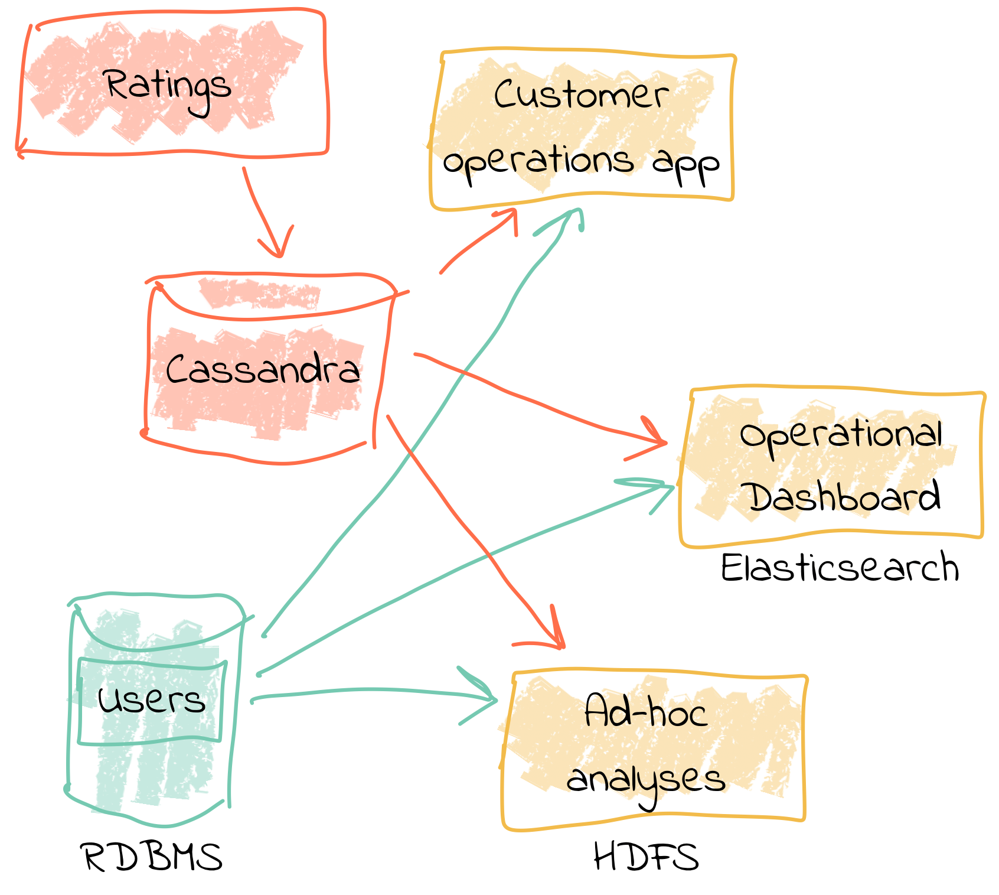
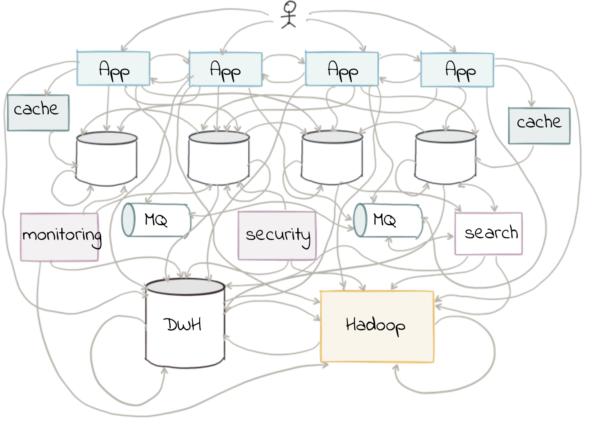
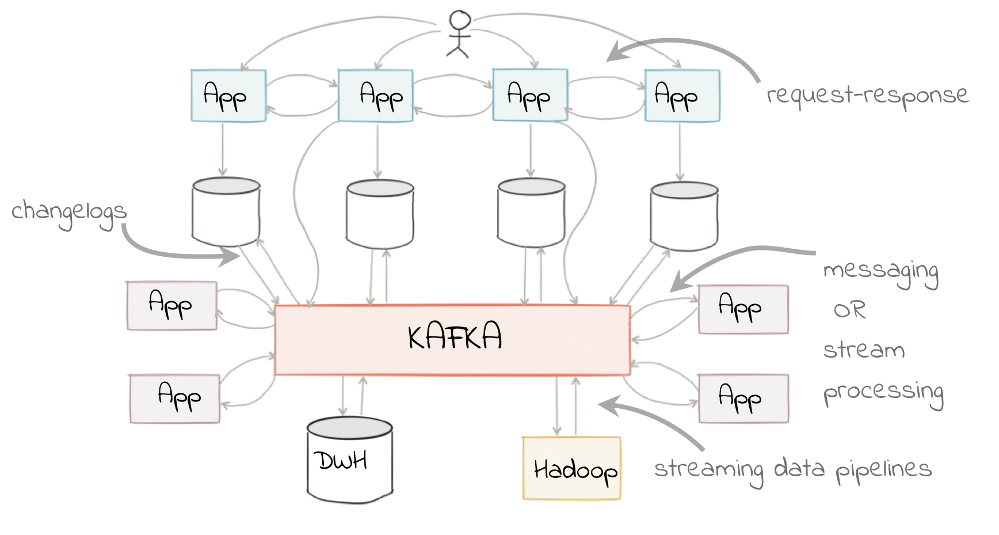

= The Changing Face of ETL : Stream Processing with Apache Kafka® and KSQL
Robin Moffatt <robin@confluent.io>
v1.20 August 29, 2018

The way in which we handle data, and build applications, is changing. Technology and development practices have evolved to a point where building systems in isolated silos is somewhat impractical, if not anachronistic. As the cliché of a cliché goes, data is the new oil, the life-blood of an organization—however you want to analogize it, the successful handling and exploitation of data in a company is critical to its success.

In this article we're going to see a practical example of a powerful design pattern based aroud event-driven architectures and a streaming platform. We'll discuss why companies are moving to adopt this, instead of legacy approaches to integrating systems—as well as driving real-time requirements. 

Part of this shift away that is happening is the blurring of lines between "analytics" systems and "transactional" systems. In the old days, we built our transactional systems on which our business ran, and then a separate team would be responsible for extracting that data and building analytics (or BI, or MIS, or DSS, depending on your age) on that. It was done in an isolated manner, and was typically a one-way feed. Analytics teams took the data, on which processing was done to cleanse and enrich it, and then reports were built.

Now, we have the beginnings of an acceptance that data is not only _generated_ by systems, but combined with other data and insights can actually be used to _power_ those systems and others—and we have the technology that enables us to do so, in real time, and at scale. It's about enabling the integration of data across departments, teams, and even companies, making it available to any application that wants to do so, and building this in such a way that is flexible, scalable, and maintainable in the long term.

As an example of this, retail banks are faced with the challenge of providing compelling customer experience to a new generation of users, whose expectations are shaped by AI-powered mobile applications from Google and Apple. In order to meet this challenge, they'll need to combine everything they know about their customers with state of the art predictive models, and provide the results to mobile apps, web apps and physical branches. https://www.youtube.com/watch?v=WdP8Vg4yASk[ING] and https://www.confluent.io/customers/rbc[RBC] used event-driven architectures to power modern systems that do exactly that. Let's dive into the technologies and design patterns that enabled them to transform the user-experience and the development process at the same time.

== ETL, but not as you know it

Consider a simple example from the world of e-commerce: On a website, user reviews are tracked through a series of events. Information about these users such as their name, contact details, and loyalty club status is held on a database elsewhere. There are at least three uses for this review data:

- Customer Operations—If a user with high loyalty club status leaves a poor review, we want to do something about it straight away, to reduce the risk of them churning. We want an application that will notify us as soon as a review meeting this condition is met. By doing so immediately we offer customer service that is far superior than had we waited for a batch process to run and flag the user for contact at a later date.
- Operational dashboard showing live feed of reviews, rolling aggregates for counts, median score, and so on—broken down by user region, etc.
- Ad-hoc analytics on review data combined with other data (whether in a data lake, data warehouse, etc). This could extend to broader data science practices and machine learning use.

All of these need access to the review information along with details of the user.

One option is to store the reviews in a database, against which we then join a user table. Perhaps we drive all the requirements against the data held in this database. There are several challenges to this approach. Since we are coupling together three separate applications to the same schema and access patterns, it becomes more difficult to make changes to one without impacting the others. In addition, one application may start to impact the performance of another—consider a large-scale analytics workload and how this could affect the operational behavior of the customer ops alerting application.

image::images/all_thru_db.png[]

In general, we would not expect to build the three applications against the same data store. Thus we extract the review and user data to target systems best suited for serving the dependent application. Perhaps a NoSQL store to drive the customer operations application, the Elastic stack for the ops dashboard, and something like HDFS/S3, or BigQuery/Snowflake DB for the analytics platform. 

Now we have the problem of:

- How to populate each target from the review data in a consistent and efficient way
- How to enrich the review data with user information - do we try and do it once before loading each target, or do we repeat the process as part of the loading of each target? Can we do this with up-to-date versions of the customer data whilst also maintaining a low-latency feed?

We also have longer-term architectural considerations. If we add new sources for the review data (e.g. mobile app, public API), how is that fed to the target systems? What if one of the target systems is offline, or running slowly—how do we buffer the data or apply back-pressure? If we want to add new targets for the data in the future, how easy will it be to do this?

== You say tomato, I say tomato

In the past we used ETL (Extract, Transform, Load) techniques purely within the data-warehousing and analytics space. But, if one considers _why_ and _what_ ETL is doing, it is actually a lot more applicable as a broader concept.

* Extract - data is available from a source system
* Transform - we want to filter, cleanse, or otherwise enrich this source data
* Load - make the data available to another application

There are two key concepts here:

* Data is created by an application, and we want it to be available to other applications.
* We often want to process the data in some way before it can be used. This could be to cleanse it, to apply business logic to it, and so on

Thinking about many applications that are being built nowadays, particularly in the microservices and event-driven space, what they do is take data from one or more systems, manipulate the data, and then pass it on to another application or system. For example—a fraud detection service will take data from merchant transactions, apply a fraud detection model, and write the results to a store such as Elastic for review by an expert. Can you spot the similarity to the above outline? Is this a microservice or ETL process? 

ETL is a design pattern, applicable to a huge variety of purposes beyond traditional data warehousing from which it originated.

== The Streaming Platform in Action

Let's see what the above e-commerce example looks like in practice when implemented using a more modern design pattern, based on a streaming platform. We're going to use the open-source Apache Kafka and KSQL projects to do this. KSQL is the streaming SQL engine for Apache Kafka, implemented on top of the Kafka Streams API which is part of Apache Kafka itself.

In our example, the _events_ are the reviews that the users submit on the site, and these are streamed directly into Kafka. From here, they can be joined to the user information _in real time_ and the resulting enriched data written back to Kafka. With this transformation done, the data can be used to drive the above applications and targets. The transformation logic is only required once. The data is extracted from the source system once. The transformed data can be used multiple times, by independent applications. New sources and targets can be added, without any change to the existing components. All of this is very low-latency.

At a high level, the design looks like this:

- Web app emits review directly to Kafka
- Kafka Connect streams snapshot of user data from database into Kafka, and keeps it directly in sync with CDC
- Stream processing adds user data to the review event, writes it back to a new Kafka topic
- Stream processing filters the enriched Kafka topic for poor reviews from VIP users, writes to a new Kafka topic
- Event-driven app listens to Kafka topic, pushes notifications as soon as VIP user leaves a poor review
- Kafka Connect streams the data to Elasticsearch for operational dashboard
- Kafka Connect streams the data to S3 for long-term ad-hoc analytics and use alongside other datasets

image::images/design.png[]

The benefits of this include:

- Data enrichment is done once, and available for any consuming application
- Processing is low latency
- Notifications to customer ops team happen as soon as the VIP customer leaves a poor review - much better customer experience, more chance of retaining their business
- Easy to scale by adding new nodes as required for greater throughput

== Transform Once, Use Many

Often the data used by one system will also be required by another, and the same goes for data that has been through enrichment or transformation. The work that we do to cleanse the inbound stream of customer details, standardize the country name, state/county identifiers, phone number formatting—all of this is going to be useful to both the analytics platform downstream, but also any other application that deals with customer data. We can formalize this into a three-tier data model, applicable to many data processing architectures. Tier 1 is the raw data. Tier 2 is the "integration layer"—data is clean and standardized, available for anyone to analyze. Tier 3 is the "application layer", in which data is joined, aggregated and formatted in a way that makes it most useful for the needs of a specific application.

A great pattern to adopt is to stream raw data ("tier 1") as it is transformed ("tier 2") _back into Kafka_. This makes that data available, in real time, to all applications directly. The alternative is the legacy pattern of writing transformed data down to a target (often a data lake), and having other applications pull the data from there—with the associated latency and complication to our systems architecture. Where applications come to consume and transform the data for their own purpose ("tier 3"), this may also be done in Kafka—or depending on technical requirements, using other technologies such as RDBMS/NoSQL/Object Store, as required.

By streaming the transformed data back into Kafka, we get some great benefits: -

1. **Separation of responsibilities**: between the transformation, and the application/system consuming that data. The latency remains low, as the transformed data that is streamed to Kafka can be streamed straight to the desired target. Even for a transformation in which you think only your application will want the transformed data, this pattern is a useful one.

2. **Transformed data can be used to drive other applications**: Because Kafka persists data, the same data can be used by multiple consumers—and completely independently. Unlike traditional message queues, data is not removed from Kafka once it has been consumed. 

3. **Single instance of the transformation code**: This instance includes any associated business logic that it implements. That means a single place in which to maintain it, a standard definition for any measures derived, and consistency in the data across systems. Contrast this to multiple systems each performing the same transformation logic. For the best will in the world, the code _will_ diverge, and you _will_ end up hunting for that needle-in-a-haystack of why your data between systems doesn't reconcile.

The goal is to avoid creating 1:1 pipelines, and instead create a hub with the platform at the centre. Traditionally ETL would be done on a point-to-point basis, taking data from a source system, and loading it to a target one. If the data was needed elsewhere it would either be extracted twice, or taken from the original target. Both of these are undesirable. The former increases the load on the source system, and the latter introduced an unnecessary dependency and coupling in the design. In short, this is how the "big ball of mud" or "spaghetti" architectures start. 

By adopting a streaming platform we decouple the sources and targets for data, and thus introduce greater flexibility to build upon and evolve an architecture.

== Let's Build It!

So far we've just looked at the theory behind a Streaming Platform and why one should consider it as a core piece of architecture in a data system. *Stay tuned* for a step-by-step to building the e-commerce example described above. In the meantime, check out some more resources around this subject: 

* https://www.confluent.io/product/ksql/[KSQL]
* https://www.confluent.io/online-talk/etl-is-dead-long-live-streams/[Online talk: ETL is Dead; Long Live Streams]